<div align="center">

# ⛏️ MC Hoster

**Локальна панель керування Minecraft-серверами**

Node.js-бекенд керує серверами в ізольованих Docker-контейнерах,
а веб-інтерфейс відкривається у браузері на `http://localhost:8080`.

[](../../actions/workflows/release.yml)


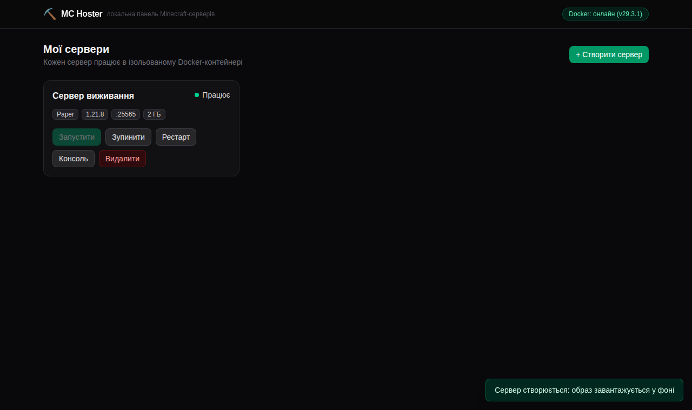

</div>

- ✅ Покроковий майстер створення: 6 ядер (Paper / Vanilla / Fabric / Spigot / Forge /
  NeoForge), версія гри ↔ версія ядра з **живих списків** (Mojang / PaperMC / FabricMC /
  Forge / NeoForge API — сумісність гарантована), повзунки ОЗП і ЦП від реальних ресурсів ПК
- ✅ Редагування після створення: назва, пам'ять і ліміт CPU (контейнер перестворюється
  автоматично, файли світу не зачіпаються)
- ✅ Керування гравцями: онлайн-список, whitelist / оператори / бани, kick/ban/op одним
  кліком (через RCON без відкриття портів), голови скінів для ліцензійних акаунтів
- ✅ Онлайн/офлайн-режим при створенні (ліцензія) та автоматична прегенерація світу
  через Chunky — прибирає лаги підвантаження чанків
- ✅ Готові бінарі у [Releases](../../releases) із вшитим Node — Node.js встановлювати не потрібно
- ✅ Образ [`itzg/minecraft-server`](https://docker-minecraft-server.readthedocs.io/) сам
  завантажує потрібний jar; панель сама підбирає правильну Java під версію гри
- ✅ Файли сервера лежать на хості (bind-mount) — світ і конфіги завжди під рукою
- ✅ Інтерактивна консоль у реальному часі: логи через WebSocket, команди у stdin контейнера
- ✅ GUI-редактор `server.properties` зі збереженням коментарів у файлі
- ✅ Живе без Docker: панель піднімається, чесно показує «Docker офлайн» і віддає 503 з поясненням

## Зміст

1. [Встановлення крок за кроком](#1-встановлення-крок-за-кроком) — 🪟 [Windows](#windows-guide) · 🍎 [macOS](#macos-guide) · 🐧 [Linux](#linux-guide)
2. [Перші кроки в панелі](#2-перші-кроки-в-панелі)
3. [Архітектура](#3-архітектура)
4. [Структура проєкту](#4-структура-проєкту-npm-workspaces)
5. [Конфігурація](#5-конфігурація)
6. [Готові збірки та власна збірка бінарів](#6-готові-збірки-exe-та-власна-збірка-бінарів)
7. [REST API та WebSocket-протокол](#7-rest-api-та-websocket-протокол)
8. [Альтернатива: чистий JRE + свій jar](#8-альтернатива-без-itzg-чистий-jre--свій-jar)
9. [Безпека](#9-безпека)
10. [Типові проблеми](#10-типові-проблеми)

---

## 1. Встановлення крок за кроком

> [!IMPORTANT]
> Незалежно від ОС і способу запуску, **обов'язково потрібен Docker** — саме в його
> контейнерах працюють Minecraft-сервери. Панель пакує лише себе, а не Docker Engine.

Для кожної ОС є два шляхи:

- **Спосіб А — готовий бінар** із [Releases](../../releases): нічого не потрібно, крім Docker.
- **Спосіб Б — з сирців**: потрібен ще Node.js 20+ (для розробки або останніх змін).

<a id="windows-guide"></a>

<details>
<summary><b>🪟 Windows — детальний гайд</b></summary>

### Крок 1. Встановіть Docker Desktop

1. Завантажте інсталятор: <https://www.docker.com/products/docker-desktop/> (кнопка *Download for Windows*).
2. Запустіть `Docker Desktop Installer.exe`. Залиште увімкненим пункт
   **Use WSL 2 instead of Hyper-V** — це рекомендований режим.
3. Якщо інсталятор попросить компонент WSL 2 — дозвольте йому встановити,
   або виконайте в PowerShell від адміністратора:

   ```powershell
   wsl --install
   ```

4. Перезавантажте комп'ютер, запустіть **Docker Desktop** із меню «Пуск»
   і дочекайтеся статусу *Engine running* (зелений кит у треї).
5. Перевірка у PowerShell:

   ```powershell
   docker version
   ```

   Має з'явитися блок `Server:` без помилок.

### Крок 2А. Запуск із готового exe (рекомендовано)

1. На сторінці [Releases](../../releases) завантажте `mc-hoster-win-x64.zip`.
2. Розпакуйте архів у зручну теку, наприклад `C:\mc-hoster`
   (ПКМ → «Видобути все…»). Усередині: `mc-hoster.exe` + тека `frontend\` —
   **не розділяйте їх**, вони працюють разом.
3. Двічі клацніть `mc-hoster.exe`.

> [!NOTE]
> **SmartScreen** може попередити про невідомого видавця (бінар не має цифрового
> підпису). Натисніть **«Докладніше» → «Виконати попри все»**. Це стандартна
> поведінка для будь-якого непідписаного exe.

4. Відкриється консольне вікно панелі — не закривайте його, поки панель потрібна.

### Крок 2Б. Запуск із сирців (потрібен Node.js)

1. Встановіть Node.js LTS: <https://nodejs.org/> або в PowerShell:

   ```powershell
   winget install OpenJS.NodeJS.LTS
   ```

2. Завантажте код: кнопка **Code → Download ZIP** на GitHub (і розпакуйте),
   або через git:

   ```powershell
   git clone https://github.com/fand1l/local_server_hoster.git
   cd local_server_hoster
   ```

3. Встановіть залежності та зберіть:

   ```powershell
   npm install
   npm run build
   npm start
   ```

### Крок 3. Відкрийте панель

У браузері перейдіть на **<http://127.0.0.1:8080>**. Праворуч угорі має світитися
зелена пілюля **«Docker: онлайн»**. Далі — розділ [«Перші кроки в панелі»](#2-перші-кроки-в-панелі).

### Корисне для Windows

- Дані панелі (світи, конфіги, БД): `%USERPROFILE%\.mc-hoster`
  (наприклад `C:\Users\Ваше_імʼя\.mc-hoster`).
- Щоб друзі з локальної мережі могли зайти на сервер, дозвольте порт гри у брандмауері
  (PowerShell від адміністратора, порт підставте свій):

  ```powershell
  netsh advfirewall firewall add rule name="Minecraft 25565" dir=in action=allow protocol=TCP localport=25565
  ```

- Автозапуск панелі разом із Windows: натисніть <kbd>Win</kbd>+<kbd>R</kbd> →
  `shell:startup` → покладіть туди ярлик на `mc-hoster.exe`.

</details>

<a id="macos-guide"></a>

<details>
<summary><b>🍎 macOS — детальний гайд</b></summary>

### Крок 1. Встановіть Docker Desktop

1. Завантажте dmg під свій процесор: <https://www.docker.com/products/docker-desktop/>
   — **Apple Silicon** (M1/M2/M3/M4) або **Intel chip**. Який у вас — дивіться
   ` → Про цей Mac`.
2. Відкрийте dmg і перетягніть **Docker** у **Applications**.
3. Запустіть Docker з Launchpad, дозвольте системні запити й дочекайтеся
   статусу *Docker Desktop is running* (кит у менюбарі).
4. Перевірка у Терміналі:

   ```bash
   docker version
   ```

### Крок 2А. Запуск із готового бінара (рекомендовано)

1. Із [Releases](../../releases) завантажте архів під свій чип:
   `mc-hoster-macos-arm64.zip` (Apple Silicon) або `mc-hoster-macos-x64.zip` (Intel).
2. Розпакуйте (подвійний клік). Усередині: бінар `mc-hoster` + тека `frontend/` —
   **тримайте їх разом**.
3. У Терміналі перейдіть у теку та запустіть:

   ```bash
   cd ~/Downloads/mc-hoster-macos-arm64
   ./mc-hoster
   ```

> [!NOTE]
> **Gatekeeper** заблокує перший запуск непідписаного бінара («не вдалося перевірити
> розробника»). Або дозвольте його в **Системні параметри → Конфіденційність і
> безпека → «Усе одно відкрити»**, або зніміть карантин однією командою:
>
> ```bash
> xattr -d com.apple.quarantine ./mc-hoster
> ```

### Крок 2Б. Запуск із сирців (потрібен Node.js)

```bash
# Node.js через Homebrew (або інсталятор з nodejs.org)
brew install node

git clone https://github.com/fand1l/local_server_hoster.git
cd local_server_hoster
npm install
npm run build
npm start
```

### Крок 3. Відкрийте панель

**<http://127.0.0.1:8080>** — угорі має бути зелена пілюля «Docker: онлайн».
Далі — розділ [«Перші кроки в панелі»](#2-перші-кроки-в-панелі).

### Корисне для macOS

- Дані панелі: `~/.mc-hoster`.
- IP для друзів у локальній мережі: `ipconfig getifaddr en0`
  (або Системні параметри → Wi-Fi → Details).
- Docker Desktop типово має доступ до вашої домашньої теки, тож bind-mount
  працює без додаткових налаштувань File Sharing.

</details>

<a id="linux-guide"></a>

<details>
<summary><b>🐧 Linux — детальний гайд</b></summary>

### Крок 1. Встановіть Docker Engine

Найшвидше — офіційний скрипт (Ubuntu/Debian/Fedora/інші):

```bash
curl -fsSL https://get.docker.com | sh
```

<sub>Або пакетами дистрибутива: `sudo apt install docker.io` (Ubuntu/Debian),
`sudo dnf install docker-ce` ([репозиторій Docker](https://docs.docker.com/engine/install/fedora/)),
`sudo pacman -S docker` (Arch).</sub>

Увімкніть службу та додайте себе у групу `docker`, щоб панель працювала без sudo:

```bash
sudo systemctl enable --now docker
sudo usermod -aG docker $USER
newgrp docker        # або повністю перелогіньтеся

docker run --rm hello-world   # перевірка: має надрукувати "Hello from Docker!"
```

> [!WARNING]
> Нові групи Linux видає лише **при вході в сесію**: усі вже відкриті термінали
> (і графічна сесія цілком) живуть зі старим списком, а `newgrp docker` діє лише
> у тому одному вікні, де його виконали. Перевірка поточного термінала: `id -nG`
> має містити `docker`. Якщо перелогінюватися зараз незручно — запускайте панель
> разово з групою: `sg docker -c "npm start"` (або `sg docker -c "./mc-hoster"`).

### Крок 2А. Запуск із готового бінара (рекомендовано)

```bash
wget https://github.com/fand1l/local_server_hoster/releases/latest/download/mc-hoster-linux-x64.zip
unzip mc-hoster-linux-x64.zip && cd mc-hoster-linux-x64
chmod +x mc-hoster    # якщо архіватор не зберіг права
./mc-hoster
```

Бінар і тека `frontend/` мають лежати поруч — не розділяйте їх.

### Крок 2Б. Запуск із сирців (потрібен Node.js 20+)

```bash
# Node.js через nvm (або пакет вашого дистрибутива, якщо він ≥ 20)
curl -o- https://raw.githubusercontent.com/nvm-sh/nvm/v0.40.1/install.sh | bash
nvm install --lts

git clone https://github.com/fand1l/local_server_hoster.git
cd local_server_hoster
npm install
npm run build
npm start
```

### Крок 3. Відкрийте панель

**<http://127.0.0.1:8080>** — угорі має бути зелена пілюля «Docker: онлайн».
Далі — розділ [«Перші кроки в панелі»](#2-перші-кроки-в-панелі).

### Корисне для Linux

- Дані панелі: `~/.mc-hoster`.
- IP для друзів у мережі: `hostname -I` (перша адреса).
- Якщо стоїть firewall — відкрийте порт гри: `sudo ufw allow 25565/tcp`.
- Автозапуск через systemd (user-unit, шлях до бінара підставте свій):

  ```ini
  # ~/.config/systemd/user/mc-hoster.service
  [Unit]
  Description=MC Hoster panel
  After=docker.service

  [Service]
  ExecStart=%h/mc-hoster/mc-hoster
  Restart=on-failure

  [Install]
  WantedBy=default.target
  ```

  ```bash
  systemctl --user enable --now mc-hoster
  ```

</details>

---

## 2. Перші кроки в панелі

Після запуску панель виглядає так — порожній дашборд і зелений індикатор Docker:

<p align="center">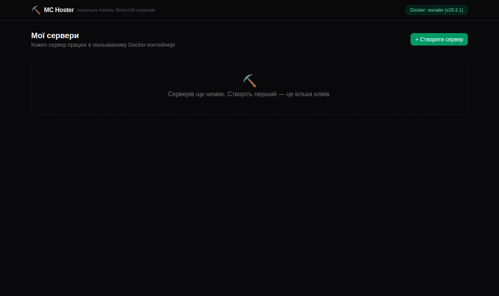</p>

### 2.1. Створіть сервер (майстер із 3 кроків)

Натисніть **«+ Створити сервер»** — відкриється покроковий майстер.

**Крок 1 — назва та ядро.** На вибір шість ядер: **Paper** (рекомендовано — оптимізований,
плагіни), **Vanilla** (чистий офіційний), **Fabric** і **Forge / NeoForge** (моди),
**Spigot** (класика плагінів):

<p align="center">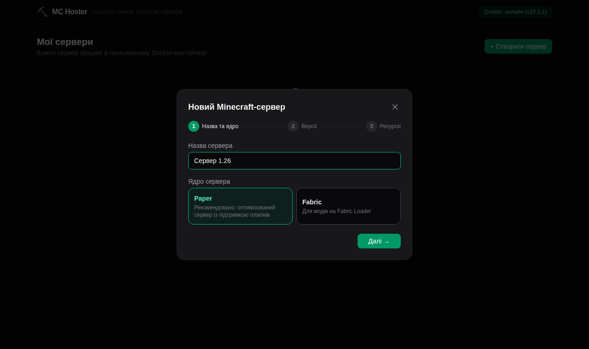</p>

**Крок 2 — версія гри та версія ядра.** Списки живі, з офіційних API (Mojang, PaperMC,
FabricMC, Forge, NeoForge), тому тут завжди є найновіші версії. Снапшоти/rc сховані за
перемикачем «тестові версії» прямо у списку. Сумісність гарантована: під обрану версію
гри показуються лише сумісні збірки ядра. За замовчуванням — «остання»:

<p align="center">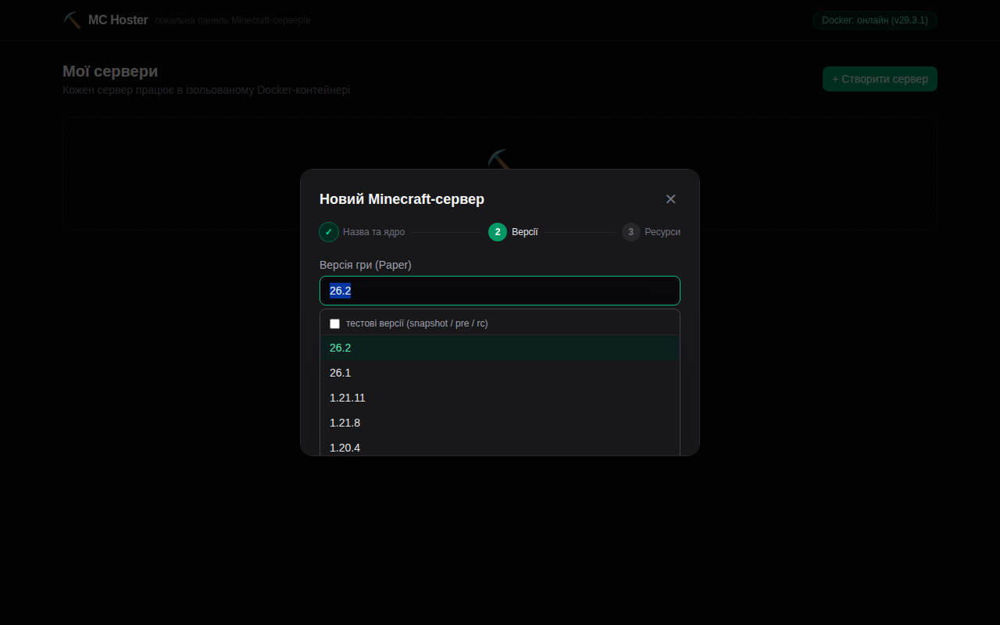</p>

**Крок 3 — ресурси та опції.** Повзунки ОЗП і ЦП обмежені реальними можливостями вашого
ПК (панель сама їх визначає). 2 ГБ вистачає на 2–5 гравців; для модпаків беріть 4 ГБ+.
Тут же:

- **Тільки ліцензійні акаунти (online-mode)** — знято галочку = офлайн-режим (пускає
  піратські клієнти, але вимикає скіни й перевірку акаунтів);
- **Автоматична прегенерація світу (Chunky)** — з'являється лише коли для обраного
  ядра+версії існує сумісна збірка Chunky (перевіряється через Modrinth). Вкажіть радіус
  у блоках — панель згенерує чанки навколо спавна одразу після запуску, і лаги
  підвантаження під час гри зникнуть.

<p align="center">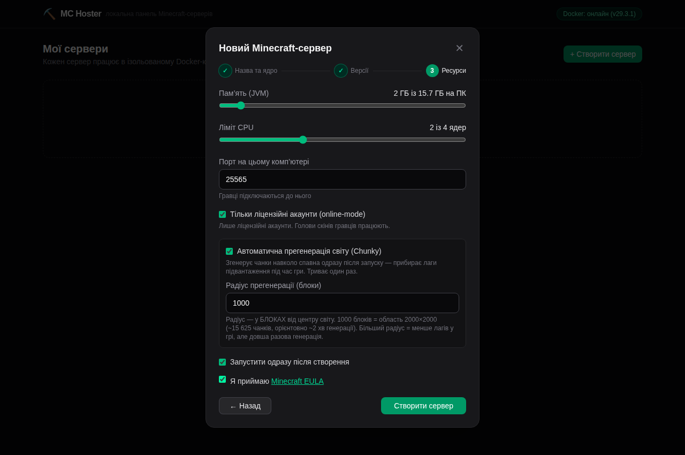</p>

### 2.2. Дочекайтеся статусу «Працює»

Перше створення триває кілька хвилин: панель завантажує Docker-образ і jar сервера
(прогрес видно прямо на картці). Далі сервери стартують за секунди.

<p align="center"></p>

### 2.3. Користуйтеся консоллю

Клацніть назву сервера або кнопку **«Консоль»** — логи течуть у реальному часі,
внизу — поле для команд (історія — стрілками ↑/↓):

<p align="center">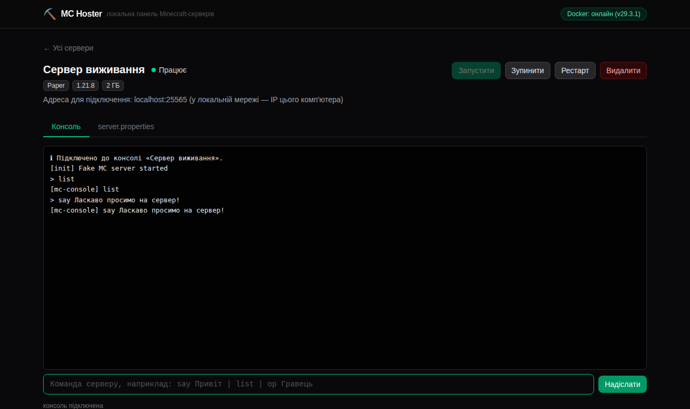</p>

Найкорисніші команди:

```
op ВашНікнейм            — дати собі права оператора
gamemode creative Нік    — змінити режим гри
whitelist add Нік        — додати гравця у білий список
say Привіт усім!         — повідомлення в чат
```

### 2.4. Налаштуйте server.properties

Вкладка **server.properties** — це GUI-редактор конфігурації сервера
(файл з'являється після першого запуску). Змінили значення → **«Зберегти зміни»** →
перезапустіть сервер кнопкою «Рестарт»:

<p align="center">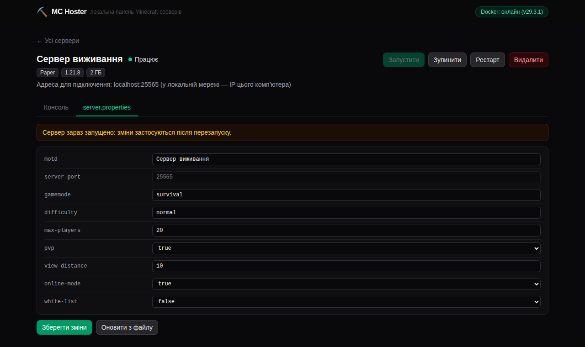</p>

### 2.5. Керуйте гравцями

Вкладка **Гравці** зводить онлайн-список (через RCON) і всіх відомих серверу гравців
(з файлів `usercache/whitelist/ops/banned`). Фільтри — онлайн / усі / whitelist /
оператори / бани; на кожному рядку дії **kick, ban, op, whitelist** одним кліком.
Для ліцензійних (online-mode) серверів підтягуються голови скінів:

<p align="center">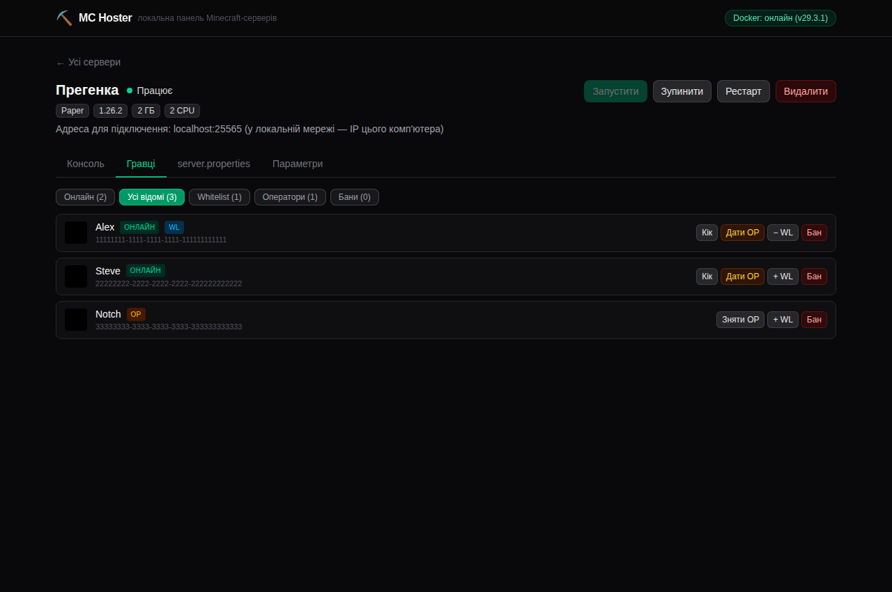</p>

> [!NOTE]
> Дії виконуються через **RCON усередині контейнера** (`docker exec rcon-cli`) — порт
> RCON назовні **не відкривається**, пароль лишається в контейнері. Якщо RCON вимкнено
> у `server.properties`, команди йдуть у консоль через stdin (без підтвердження виконання).

### 2.6. Редагуйте параметри сервера

Вкладка **Параметри** — зміна налаштувань уже створеного сервера: назва редагується
будь-коли, а пам'ять і ліміт CPU — коли сервер зупинено (панель перестворює контейнер
із новими лімітами; файли світу лежать на диску і не зачіпаються):

<p align="center">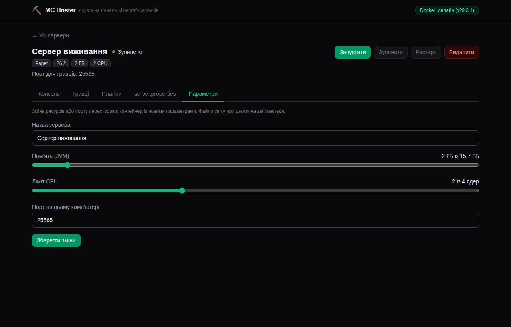</p>

### 2.7. Зайдіть у гру

| Хто підключається | Адреса у грі (Multiplayer → Add Server) |
| --- | --- |
| Ви, на цьому ж комп'ютері | `localhost:25565` |
| Друзі з вашої локальної мережі | `IP-вашого-компʼютера:25565` (як дізнатись IP — див. «Корисне» у гайді своєї ОС) |
| Друзі з інтернету | Потрібен проброс порту гри на роутері (port forwarding) на IP вашого ПК. Прокидайте **лише порт гри**, ніколи — порт панелі 8080 |

---

## 3. Архітектура

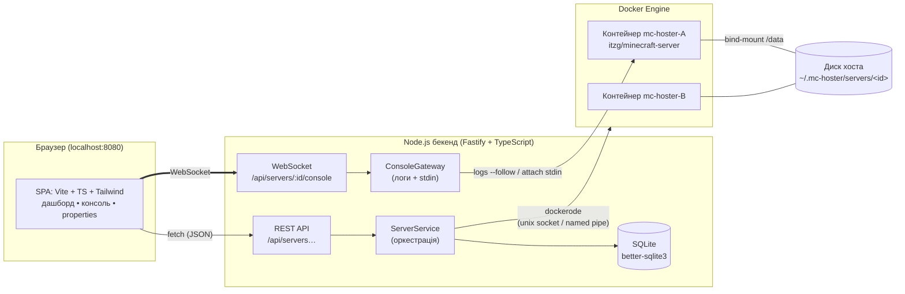

### Потік «інтерактивна консоль» покроково

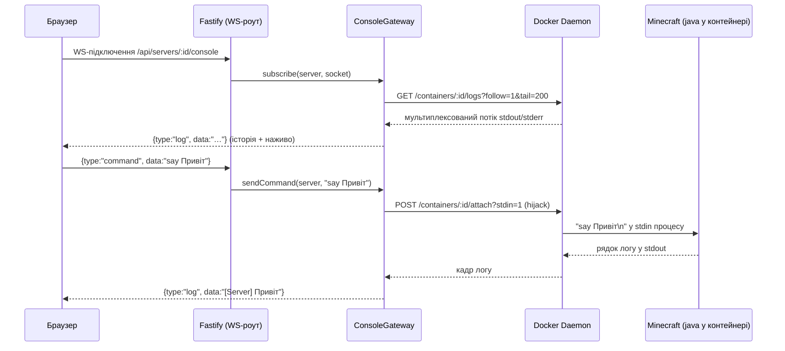

Ключові рішення:

| Питання | Рішення |
| --- | --- |
| Звідки береться jar сервера | Образ `itzg/minecraft-server` завантажує його сам (`TYPE`, `VERSION` у env). Панель лише тягне образ через Docker API |
| Версія Java | `resolveImageForVersion()`: ≤1.16 → `java8-multiarch`, 1.17–1.20.4 → `java17`, 1.20.5+ → `java21`, нечислові (`LATEST`) → `latest` |
| Ізоляція | Один сервер = один контейнер: ліміт пам'яті, свій порт, RestartPolicy `unless-stopped` |
| Файли сервера | Bind-mount `<dataRoot>/servers/<id>` → `/data` контейнера |
| Коректна зупинка | `docker stop` з таймаутом 60 с; всередині образу `mc-server-runner` перетворює SIGTERM на команду `stop` (світ зберігається) |
| Стан у БД vs Docker | SQLite зберігає лише опис сервера; живий стан (`running/stopped`) щоразу читається з Docker — жодних розсинхронів |
| Docker не запущено | Кожна операція повертає `503 DOCKER_UNAVAILABLE` з людським текстом; UI показує банер |

---

## 4. Структура проєкту (npm workspaces)

```
local_server_hoster/
├── package.json               # монорепозиторій: scripts dev/build/start
├── tsconfig.base.json         # спільні строгі налаштування TS
├── .github/workflows/
│   └── release.yml            # збірка бінарів win/mac/linux + GitHub Release
├── docs/screenshots/          # скріншоти для цього README
├── backend/                   # Fastify + dockerode + better-sqlite3
│   ├── scripts/package.mjs    # esbuild → pkg → staging-тека бінара
│   └── src/
│       ├── index.ts           # точка входу: конфіг → БД → Docker → роути → listen
│       ├── app.ts             # Fastify: плагіни, error handler, роздача фронтенду
│       ├── config.ts          # env-конфігурація (порт, директорії даних)
│       ├── types.ts           # доменні типи (ServerRecord, DTO, WS-протокол)
│       ├── errors.ts          # AppError-ієрархія + переклад помилок Docker
│       ├── db/
│       │   ├── index.ts       # відкриття SQLite + міграції (user_version)
│       │   └── serverRepository.ts
│       ├── docker/
│       │   ├── client.ts      # singleton dockerode, ping, ensureImage (pull + прогрес)
│       │   ├── containerManager.ts   # create/start/stop/restart/remove/inspect
│       │   └── consoleGateway.ts     # WS-сесії: logs --follow + attach stdin
│       ├── minecraft/
│       │   ├── images.ts      # itzg-образ: env, вибір Java, ліміти пам'яті
│       │   ├── versionCatalog.ts  # живі версії гри/ядра + Chunky (Mojang/Paper/Fabric/Forge/NeoForge/Modrinth)
│       │   └── properties.ts  # парсер server.properties (зберігає коментарі)
│       ├── services/
│       │   ├── serverService.ts      # оркестрація CRUD + життєвого циклу
│       │   ├── playerService.ts      # гравці: RCON (docker exec) + файли сервера
│       │   └── pregenScheduler.ts    # автопрегенерація Chunky після старту (RCON-проба)
│       ├── routes/
│       │   ├── servers.ts     # REST CRUD + start/stop/restart/PATCH (zod-валідація)
│       │   ├── properties.ts  # GET/PUT server.properties
│       │   ├── players.ts     # GET гравці / POST дія над гравцем
│       │   ├── meta.ts        # версії гри/ядра + доступність прегенерації
│       │   ├── system.ts      # GET /api/system (стан Docker + ресурси)
│       │   └── console.ws.ts  # WebSocket-роут консолі
│       └── utils/             # порти (probe), шляхи (bind-mount, захист rm -rf)
├── frontend/                  # Vite + TypeScript + Tailwind CSS 4 (vanilla, без фреймворка)
│   └── src/
│       ├── main.ts            # каркас, hash-роутер, банер стану Docker
│       ├── api.ts             # типізований REST-клієнт
│       ├── ws.ts              # ConsoleConnection з автоперепідключенням
│       ├── dom.ts             # міні-хелпер el() замість фреймворка
│       ├── ui.ts / toast.ts / modals.ts
│       ├── types.ts           # дзеркало DTO бекенду
│       └── views/
│           ├── dashboard.ts   # картки серверів + створення
│           └── serverDetail.ts# консоль + редактор properties
└── docker/
    └── custom-jre/            # альтернатива: чистий JRE + свій server.jar
        ├── Dockerfile
        └── entrypoint.sh
```

---

## 5. Конфігурація

Все налаштовується змінними середовища (дефолти підібрані «щоб просто працювало»):

| Змінна | Типово | Опис |
| --- | --- | --- |
| `MC_HOSTER_PORT` | `8080` | Порт веб-панелі |
| `MC_HOSTER_HOST` | `127.0.0.1` | Інтерфейс панелі. **Не відкривайте назовні** — авторизації немає |
| `MC_HOSTER_DATA_DIR` | `~/.mc-hoster` | БД + директорії серверів (`servers/<id>`) |
| `MC_HOSTER_GAME_BIND_HOST` | `0.0.0.0` | Куди публікувати ігрові порти (0.0.0.0 = доступно з LAN) |
| `MC_HOSTER_FRONTEND_DIR` | автопошук | Явний шлях до збірки фронтенду (для нетипових розкладок) |
| `DOCKER_HOST` та ін. | — | Стандартні змінні Docker; без них: unix-сокет (Linux/macOS) або named pipe (Windows) |
| `MC_HOSTER_MOJANG_META_URL` / `MC_HOSTER_PAPER_META_URL` / `MC_HOSTER_PAPER_FILL_URL` / `MC_HOSTER_FABRIC_META_URL` / `MC_HOSTER_FORGE_META_URL` / `MC_HOSTER_NEOFORGE_META_URL` / `MC_HOSTER_MODRINTH_URL` | офіційні API | Перевизначення URL каталогів версій і Modrinth (дзеркала, тести) |
| `LOG_LEVEL` | `info` | Рівень логів бекенду (pino) |

Скрипти розробника:

```bash
npm run dev         # гарячий перезапуск бекенду (:8080) + Vite HMR (:5173, проксі /api)
npm run typecheck   # строгий tsc для обох пакетів
npm run build       # продакшен-збірка фронтенду і бекенду
```

---

## 6. Готові збірки (.exe) та власна збірка бінарів

На вкладці **[Releases](../../releases)** лежать самодостатні збірки, у які **вшито
Node 22** — покрокові інструкції запуску див. у [гайдах для своєї ОС](#1-встановлення-крок-за-кроком).
Кожен архів містить `README.txt`, а тека `frontend/` має завжди лежати поруч із бінаром.

### Як це збирається

Релізи створює **GitHub Actions** (`.github/workflows/release.yml`): пуш тега `v*`
запускає матрицю Windows / macOS / Linux, кожен раннер збирає бінар під свою ОС і
чіпляє zip-архіви до GitHub Release автоматично.

```bash
git tag v0.1.0
git push origin v0.1.0    # → workflow збере й опублікує реліз
```

Конвеєр пакування (`backend/scripts/package.mjs`):

1. **esbuild** бандлить `src/index.ts` (ESM) у єдиний CommonJS-файл; npm-залежності
   лишаються external і беруться з `node_modules` (щоб не ламати динамічні `require`
   всередині fastify/dockerode й обійти проблеми pkg з ESM).
2. **[@yao-pkg/pkg](https://github.com/yao-pkg/pkg)** вшиває Node 22 і нативний
   аддон `better-sqlite3` у виконуваний файл.
3. Збирається staging-тека `mc-hoster-<os>-<arch>/` = бінар + `frontend/dist`
   (сайдкар) + `README.txt`, яку CI зіпує в асет релізу.

Зібрати бінар **локально під свою ОС** (потрібні Node 20+ та інтернет для pkg-fetch):

```bash
npm ci
npm run build -w frontend
npm run package -w backend      # → dist-release/mc-hoster-<os>-<arch>/
```

> [!NOTE]
> Крос-компіляція під іншу ОС не підтримується: нативний `better-sqlite3` має
> відповідати цільовій платформі, тож кожен бінар збирається на «своїй» ОС.

---

## 7. REST API та WebSocket-протокол

| Метод і шлях | Опис |
| --- | --- |
| `GET /api/system` | `{ dockerAvailable, dockerVersion, totalMemoryMb, cpuCount }` |
| `GET /api/meta/versions?kind=` | Версії гри для ядра (живі списки з Mojang/PaperMC/FabricMC, кеш 30 хв, `source: online\|fallback`) |
| `GET /api/meta/core-versions?kind=&version=` | Сумісні версії ядра (білди Paper / лоадери Fabric / версії Forge / NeoForge) під версію гри |
| `GET /api/meta/pregen?kind=&version=` | Чи доступна автопрегенерація Chunky для цього ядра+версії (перевірка Modrinth) |
| `GET /api/servers` | Список серверів + живий стан (`runtime: creating/running/stopped/error/unknown`) |
| `POST /api/servers` | Створити: `{ name, kind, version, coreVersion?, hostPort, memoryMb, cpuCores?, onlineMode, pregenRadius?, acceptEula: true, autoStart }` → `201`, провізія у фоні |
| `GET /api/servers/:id` | Один сервер |
| `PATCH /api/servers/:id` | Змінити `{ name?, memoryMb?, cpuCores? }`; ресурси — лише на зупиненому (контейнер перестворюється) |
| `POST /api/servers/:id/start` | Запуск (перестворює контейнер після помилки/видалення вручну) |
| `POST /api/servers/:id/stop` | Graceful stop (до 60 с на збереження світу) |
| `POST /api/servers/:id/restart` | Перезапуск |
| `DELETE /api/servers/:id?deleteData=true\|false` | Видалити контейнер (+ опційно файли світу) → `204` |
| `GET /api/servers/:id/properties` | `{ exists, entries: [{key,value}], warning }` |
| `PUT /api/servers/:id/properties` | Оновити значення; коментарі та невідомі ключі у файлі зберігаються |
| `GET /api/servers/:id/players` | Гравці: онлайн (RCON) + відомі (файли) + whitelist/ops/bans |
| `POST /api/servers/:id/players/action` | `{ player, action }` — kick/ban/pardon/op/deop/whitelist-add/whitelist-remove |
| `GET /api/servers/:id/console` (WS) | Консоль у реальному часі |

Помилки завжди мають форму `{ "error": { "code", "message" } }`
(`400 VALIDATION_ERROR`, `404 NOT_FOUND`, `409 CONFLICT`, `503 DOCKER_UNAVAILABLE`, …).

**WebSocket:** сервер шле `{type:'log',data}`, `{type:'info'|'error',message}`,
`{type:'status',runtime}`; клієнт шле `{type:'command',data:'say Привіт'}`.
Один сервер = одна спільна сесія логів на всі відкриті вкладки.

---

## 8. Альтернатива без itzg: чистий JRE + свій jar

Якщо потрібен власний `server.jar` (наприклад, кастомна збірка), у
[`docker/custom-jre`](docker/custom-jre/Dockerfile) є мінімальний образ:

```bash
docker build -t mc-hoster/custom-jre:21 docker/custom-jre
docker run -d -i --name my-server -p 25565:25565 \
  -v /шлях/до/сервера:/data -e MEMORY=2048M -e EULA=TRUE \
  mc-hoster/custom-jre:21
```

`-i` обовʼязковий — без відкритого stdin консоль команд не працюватиме.

---

## 9. Безпека

- Панель слухає **тільки 127.0.0.1** і **не має авторизації** — це інструмент для
  локальної машини. Не прокидайте її порт в інтернет без reverse-proxy з автентифікацією.
- Бекенд спілкується з Docker-сокетом — фактично це root-еквівалент на машині.
  Запускайте панель лише від користувача, якому ви й так довіряєте Docker.
- Видалення даних сервера захищене перевіркою, що шлях лежить строго всередині
  `MC_HOSTER_DATA_DIR/servers` (див. `utils/paths.ts`).

---

## 10. Типові проблеми

Якщо Docker не запущено, панель не «падає», а чесно показує стан і пояснює, що робити:

<p align="center">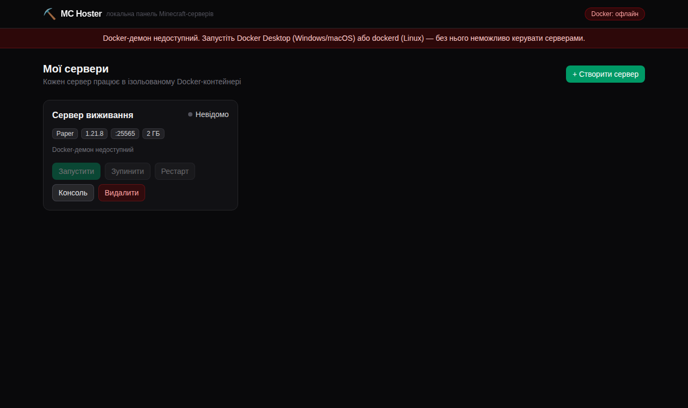</p>

| Симптом | Причина / рішення |
| --- | --- |
| Банер «Docker офлайн», API віддає 503 | Демон не запущено. Windows/macOS: відкрийте Docker Desktop; Linux: `sudo systemctl start docker` |
| `EACCES /var/run/docker.sock` (Linux) | Процес панелі не має групи `docker` — детальний розбір одразу під цією таблицею |
| `eula.txt: Permission denied` у консолі сервера (Fedora/RHEL) | SELinux блокував запис у bind-mount. Виправлено: панель монтує `/data` з міткою `:Z`, а старі контейнери без неї автоматично перестворюються при запуску |
| Порт зайнятий при створенні | Панель перевіряє порт одразу і повертає 409; оберіть інший або звільніть порт |
| Windows: контейнер не бачить файли | У Docker Desktop → Settings → Resources → File Sharing додайте диск/теку з `MC_HOSTER_DATA_DIR` (тека у профілі користувача зазвичай уже доступна) |
| `server.properties` порожній у GUI | Файл зʼявляється після першого запуску сервера — запустіть і оновіть вкладку |
| Старі версії MC не стартують | Панель сама обирає образ з Java 8/17/21 за версією; для екзотичних збірок використовуйте кастомний образ ([розділ 8](#8-альтернатива-без-itzg-чистий-jre--свій-jar)) |
| SmartScreen / Gatekeeper блокує бінар | Бінарі не мають цифрового підпису — це очікувано; як дозволити, описано у гайдах ОС ([розділ 1](#1-встановлення-крок-за-кроком)) |

### Linux: `docker ps` працює, а панель однаково каже EACCES

Класична пастка після `sudo usermod -aG docker $USER`: нові групи Linux видає
лише **при вході в сесію**. Усі вже відкриті термінали — і графічна сесія
цілком — живуть зі старим списком груп, тому перезапуск панелі з такого
термінала нічого не змінює. `newgrp docker` теж діє лише в тому одному вікні,
де його виконали (саме тому `docker ps` «в сусідньому терміналі працює»).

Перевірте, чи має **поточний** термінал групу:

```bash
id -nG        # у списку має бути "docker"
```

Якщо групи немає — два виходи:

```bash
# 1) Одразу, з будь-якого термінала, без релогіна:
sg docker -c "npm start"          # запуск із сирців
sg docker -c "./mc-hoster"        # запуск готового бінара

# 2) Назавжди: повний вихід із сесії (logout) і вхід знову — або перезавантаження.
#    Після цього панель запускається звичайним npm start / ./mc-hoster.
```
