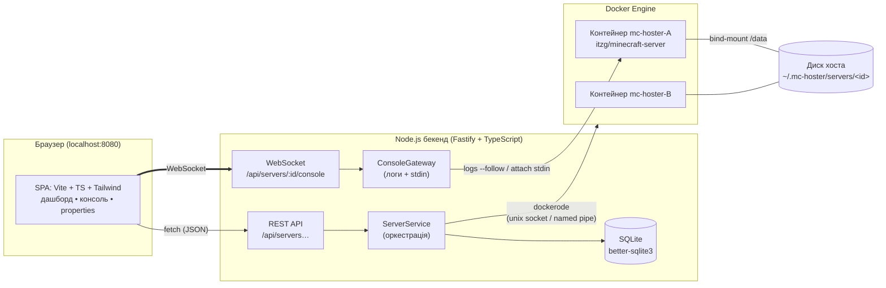
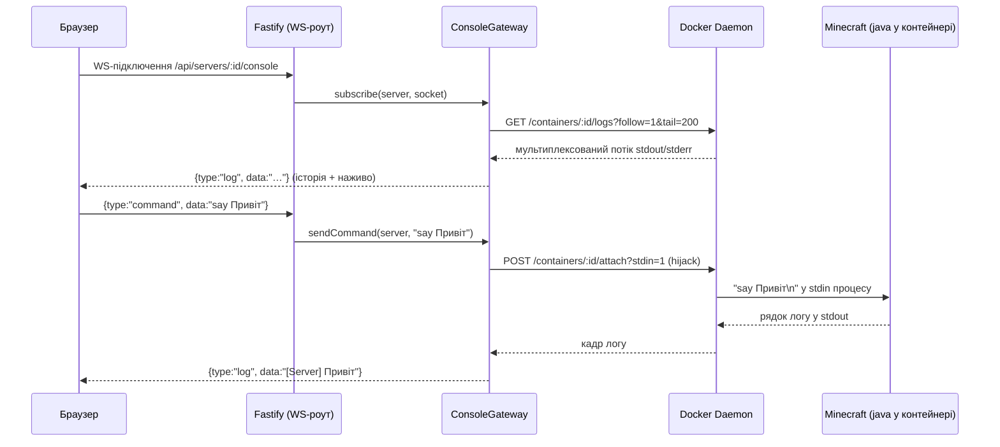

# ⛏️ MC Hoster — локальна панель Minecraft-серверів

Self-hosted GUI-хостер: **Node.js-бекенд** керує Minecraft-серверами в ізольованих
**Docker-контейнерах**, а **веб-інтерфейс** відкривається у браузері на `http://localhost:8080`.

- ✅ Кросплатформність: Windows / Linux / macOS (потрібен лише Docker + Node.js 20+)
- ✅ Готові бінарі у [Releases](../../releases) із вшитим Node — без встановлення Node.js ([розділ 4](#4-готові-збірки-exe-та-власна-збірка-бінарів))
- ✅ Створення сервера у пару кліків: ядро (Paper / Vanilla / Fabric), версія, порт, пам'ять
- ✅ Образ [`itzg/minecraft-server`](https://docker-minecraft-server.readthedocs.io/) сам
  завантажує потрібний jar; панель сама підбирає правильну Java під версію гри
- ✅ Файли сервера лежать на хості (bind-mount) — світ і конфіги завжди під рукою
- ✅ Інтерактивна консоль у реальному часі: логи через WebSocket, команди у stdin контейнера
- ✅ GUI-редактор `server.properties` зі збереженням коментарів у файлі
- ✅ Живе без Docker: панель піднімається, чесно показує «Docker офлайн» і віддає 503 з поясненням

---

## 1. Архітектура



### Потік «інтерактивна консоль» покроково



Ключові рішення:

| Питання | Рішення |
| --- | --- |
| Звідки береться jar сервера | Образ `itzg/minecraft-server` завантажує його сам (`TYPE`, `VERSION` у env). Панель лише тягне образ через Docker API |
| Версія Java | `resolveImageForVersion()`: ≤1.16 → `java8-multiarch`, 1.17–1.20.4 → `java17`, 1.20.5+ → `java21`, нечислові (`LATEST`) → `latest` |
| Ізоляція | Один сервер = один контейнер: ліміт пам'яті, свій порт, RestartPolicy `unless-stopped` |
| Файли сервера | Bind-mount `<dataRoot>/servers/<id>` → `/data` контейнера |
| Коректна зупинка | `docker stop` з таймаутом 60 с; всередині образу `mc-server-runner` перетворює SIGTERM на команду `stop` (світ зберігається) |
| Стан у БД vs Docker | SQLite зберігає лише опис сервера; живий стан (`running/stopped`) щоразу читається з Docker — жодних розсинхронів |
| Docker не запущено | Кожна операція повертає `503 DOCKER_UNAVAILABLE` з людським текстом; UI показує банер |

---

## 2. Структура проєкту (npm workspaces)

```
local_server_hoster/
├── package.json               # монорепозиторій: scripts dev/build/start
├── tsconfig.base.json         # спільні строгі налаштування TS
├── backend/                   # Fastify + dockerode + better-sqlite3
│   └── src/
│       ├── index.ts           # точка входу: конфіг → БД → Docker → роути → listen
│       ├── app.ts             # Fastify: плагіни, error handler, роздача фронтенду
│       ├── config.ts          # env-конфігурація (порт, директорії даних)
│       ├── types.ts           # доменні типи (ServerRecord, DTO, WS-протокол)
│       ├── errors.ts          # AppError-ієрархія + переклад помилок Docker
│       ├── db/
│       │   ├── index.ts       # відкриття SQLite + міграції (user_version)
│       │   └── serverRepository.ts
│       ├── docker/
│       │   ├── client.ts      # singleton dockerode, ping, ensureImage (pull + прогрес)
│       │   ├── containerManager.ts   # create/start/stop/restart/remove/inspect
│       │   └── consoleGateway.ts     # WS-сесії: logs --follow + attach stdin
│       ├── minecraft/
│       │   ├── images.ts      # itzg-образ: env, вибір Java, ліміти пам'яті
│       │   └── properties.ts  # парсер server.properties (зберігає коментарі)
│       ├── services/
│       │   └── serverService.ts      # оркестрація CRUD + життєвого циклу
│       ├── routes/
│       │   ├── servers.ts     # REST CRUD + start/stop/restart (zod-валідація)
│       │   ├── properties.ts  # GET/PUT server.properties
│       │   ├── system.ts      # GET /api/system (стан Docker)
│       │   └── console.ws.ts  # WebSocket-роут консолі
│       └── utils/             # порти (probe), шляхи (bind-mount, захист rm -rf)
├── frontend/                  # Vite + TypeScript + Tailwind CSS 4 (vanilla, без фреймворка)
│   └── src/
│       ├── main.ts            # каркас, hash-роутер, банер стану Docker
│       ├── api.ts             # типізований REST-клієнт
│       ├── ws.ts              # ConsoleConnection з автоперепідключенням
│       ├── dom.ts             # міні-хелпер el() замість фреймворка
│       ├── ui.ts / toast.ts / modals.ts
│       ├── types.ts           # дзеркало DTO бекенду
│       └── views/
│           ├── dashboard.ts   # картки серверів + створення
│           └── serverDetail.ts# консоль + редактор properties
└── docker/
    └── custom-jre/            # альтернатива: чистий JRE + свій server.jar
        ├── Dockerfile
        └── entrypoint.sh
```

---

## 3. Швидкий старт

Потрібні: **Node.js ≥ 20**, **Docker** (Docker Desktop на Windows/macOS, `dockerd` на Linux).

```bash
npm install          # ставить залежності обох пакетів (workspaces)

# Продакшен-режим: один порт на все
npm run build        # фронтенд (vite build) + бекенд (tsc)
npm start            # панель на http://127.0.0.1:8080

# Режим розробки: гарячий перезапуск бекенду + HMR фронтенду
npm run dev          # бекенд :8080, UI на http://localhost:5173 (проксі /api → 8080)
```

Далі у браузері: **«+ Створити сервер»** → обрати ядро/версію/порт → панель сама стягне
образ (перший раз — кілька хвилин), створить контейнер і запустить сервер.
Гравці підключаються до `<IP-компʼютера>:<порт>`.

### Змінні середовища

| Змінна | Типово | Опис |
| --- | --- | --- |
| `MC_HOSTER_PORT` | `8080` | Порт веб-панелі |
| `MC_HOSTER_HOST` | `127.0.0.1` | Інтерфейс панелі. **Не відкривайте назовні** — авторизації немає |
| `MC_HOSTER_DATA_DIR` | `~/.mc-hoster` | БД + директорії серверів (`servers/<id>`) |
| `MC_HOSTER_GAME_BIND_HOST` | `0.0.0.0` | Куди публікувати ігрові порти (0.0.0.0 = доступно з LAN) |
| `DOCKER_HOST` та ін. | — | Стандартні змінні Docker; без них: unix-сокет (Linux/macOS) або named pipe (Windows) |
| `LOG_LEVEL` | `info` | Рівень логів бекенду (pino) |

---

## 4. Готові збірки (.exe) та власна збірка бінарів

Не хочете ставити Node.js? На вкладці **[Releases](../../releases)** лежать
самодостатні збірки, у які **вшито Node 22** — потрібно лише розпакувати й запустити.

> ⚠️ Docker усе одно обов'язковий. Бінар пакує тільки панель, а не Docker Engine.
> Встановіть Docker Desktop (Windows/macOS) або `dockerd` (Linux) окремо.

| ОС | Архів | Як запустити |
| --- | --- | --- |
| Windows | `mc-hoster-win-x64.zip` | Розпакувати → двічі клацнути `mc-hoster.exe` (SmartScreen: «Докладніше» → «Виконати попри все») |
| macOS | `mc-hoster-macos-*.zip` | Розпакувати → `./mc-hoster` у терміналі (Gatekeeper: дозволити в «Конфіденційність і безпека») |
| Linux | `mc-hoster-linux-x64.zip` | Розпакувати → `./mc-hoster` |

Після запуску відкрийте <http://127.0.0.1:8080>. **Тримайте теку `frontend/` поруч
із бінаром** — панель віддає інтерфейс саме звідти (шлях можна перевизначити через
`MC_HOSTER_FRONTEND_DIR`). Кожен архів містить `README.txt` з інструкцією.

### Як це збирається

Релізи створює **GitHub Actions** (`.github/workflows/release.yml`): пуш тега `v*`
запускає матрицю Windows / macOS / Linux, кожен раннер збирає бінар під свою ОС і
чіпляє zip-архіви до GitHub Release автоматично.

```bash
git tag v0.1.0
git push origin v0.1.0    # → workflow збере й опублікує реліз
```

Конвеєр пакування (`backend/scripts/package.mjs`):

1. **esbuild** бандлить `src/index.ts` (ESM) у єдиний CommonJS-файл; npm-залежності
   лишаються external і беруться з `node_modules` (щоб не ламати динамічні `require`
   всередині fastify/dockerode й обійти проблеми pkg з ESM).
2. **[@yao-pkg/pkg](https://github.com/yao-pkg/pkg)** вшиває Node 22 і нативний
   аддон `better-sqlite3` у виконуваний файл.
3. Збирається staging-тека `mc-hoster-<os>-<arch>/` = бінар + `frontend/dist`
   (сайдкар) + `README.txt`, яку CI зіпує в асет релізу.

Зібрати бінар **локально під свою ОС** (потрібні Node 20+ та інтернет для pkg-fetch):

```bash
npm ci
npm run build -w frontend
npm run package -w backend      # → dist-release/mc-hoster-<os>-<arch>/
```

> Крос-компіляція під іншу ОС не підтримується: нативний `better-sqlite3` має
> відповідати цільовій платформі, тож кожен бінар збирається на «своїй» ОС.

## 5. REST API та WebSocket-протокол

| Метод і шлях | Опис |
| --- | --- |
| `GET /api/system` | `{ dockerAvailable, dockerVersion }` |
| `GET /api/servers` | Список серверів + живий стан (`runtime: creating/running/stopped/error/unknown`) |
| `POST /api/servers` | Створити: `{ name, kind, version, hostPort, memoryMb, acceptEula: true, autoStart }` → `201`, провізія у фоні |
| `GET /api/servers/:id` | Один сервер |
| `POST /api/servers/:id/start` | Запуск (перестворює контейнер після помилки/видалення вручну) |
| `POST /api/servers/:id/stop` | Graceful stop (до 60 с на збереження світу) |
| `POST /api/servers/:id/restart` | Перезапуск |
| `DELETE /api/servers/:id?deleteData=true\|false` | Видалити контейнер (+ опційно файли світу) → `204` |
| `GET /api/servers/:id/properties` | `{ exists, entries: [{key,value}], warning }` |
| `PUT /api/servers/:id/properties` | Оновити значення; коментарі та невідомі ключі у файлі зберігаються |
| `GET /api/servers/:id/console` (WS) | Консоль у реальному часі |

Помилки завжди мають форму `{ "error": { "code", "message" } }`
(`400 VALIDATION_ERROR`, `404 NOT_FOUND`, `409 CONFLICT`, `503 DOCKER_UNAVAILABLE`, …).

**WebSocket:** сервер шле `{type:'log',data}`, `{type:'info'|'error',message}`,
`{type:'status',runtime}`; клієнт шле `{type:'command',data:'say Привіт'}`.
Один сервер = одна спільна сесія логів на всі відкриті вкладки.

---

## 6. Альтернатива без itzg: чистий JRE + свій jar

Якщо потрібен власний `server.jar` (наприклад, кастомна збірка), у
[`docker/custom-jre`](docker/custom-jre/Dockerfile) є мінімальний образ:

```bash
docker build -t mc-hoster/custom-jre:21 docker/custom-jre
docker run -d -i --name my-server -p 25565:25565 \
  -v /шлях/до/сервера:/data -e MEMORY=2048M -e EULA=TRUE \
  mc-hoster/custom-jre:21
```

`-i` обовʼязковий — без відкритого stdin консоль команд не працюватиме.

---

## 7. Безпека

- Панель слухає **тільки 127.0.0.1** і **не має авторизації** — це інструмент для
  локальної машини. Не пробрасывайте її порт в інтернет без reverse-proxy з автентифікацією.
- Бекенд спілкується з Docker-сокетом — фактично це root-еквівалент на машині.
  Запускайте панель лише від користувача, якому ви й так довіряєте Docker.
- Видалення даних сервера захищене перевіркою, що шлях лежить строго всередині
  `MC_HOSTER_DATA_DIR/servers` (див. `utils/paths.ts`).

## 8. Типові проблеми

| Симптом | Причина / рішення |
| --- | --- |
| Банер «Docker офлайн», API віддає 503 | Демон не запущено. Windows/macOS: відкрийте Docker Desktop; Linux: `sudo systemctl start docker`. На Linux користувач має бути у групі `docker` |
| `EACCES /var/run/docker.sock` | `sudo usermod -aG docker $USER` і перелогіньтесь |
| Порт зайнятий при створенні | Панель перевіряє порт одразу і повертає 409; оберіть інший або звільніть порт |
| Windows: контейнер не бачить файли | У Docker Desktop → Settings → Resources → File Sharing додайте диск/теку з `MC_HOSTER_DATA_DIR` (тека у профілі користувача зазвичай уже доступна) |
| `server.properties` порожній у GUI | Файл зʼявляється після першого запуску сервера — запустіть і оновіть вкладку |
| Старі версії MC не стартують | Панель сама обирає образ з Java 8/17/21 за версією; для екзотичних збірок використовуйте кастомний образ (розділ 5) |

## 9. Скрипти розробника

```bash
npm run typecheck   # строгий tsc для обох пакетів
npm run build       # продакшен-збірка
npm run dev         # concurrently: tsx watch + vite dev
```
